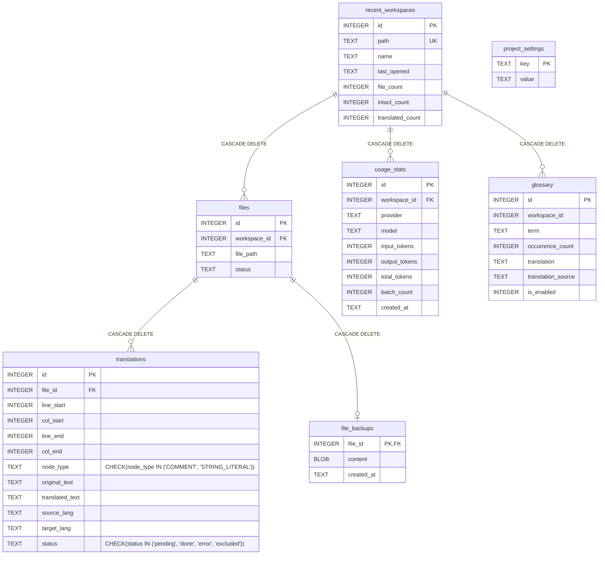
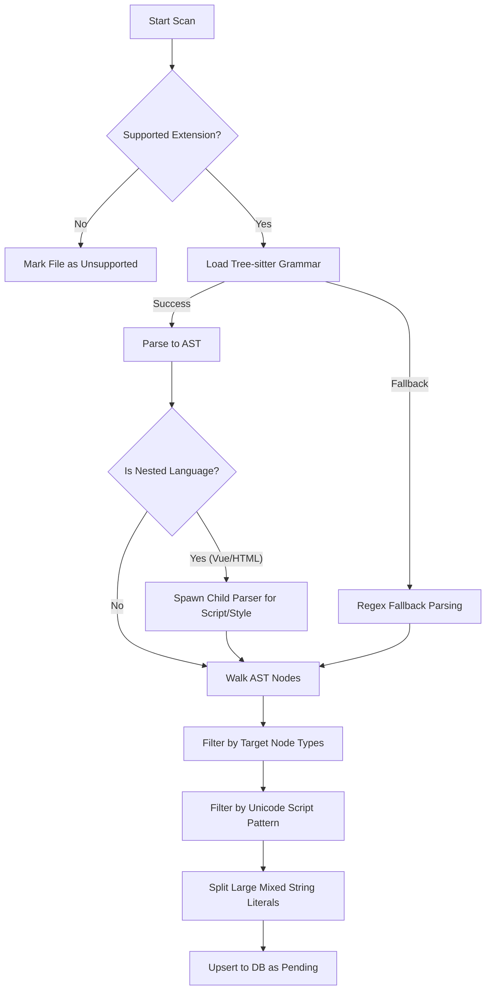
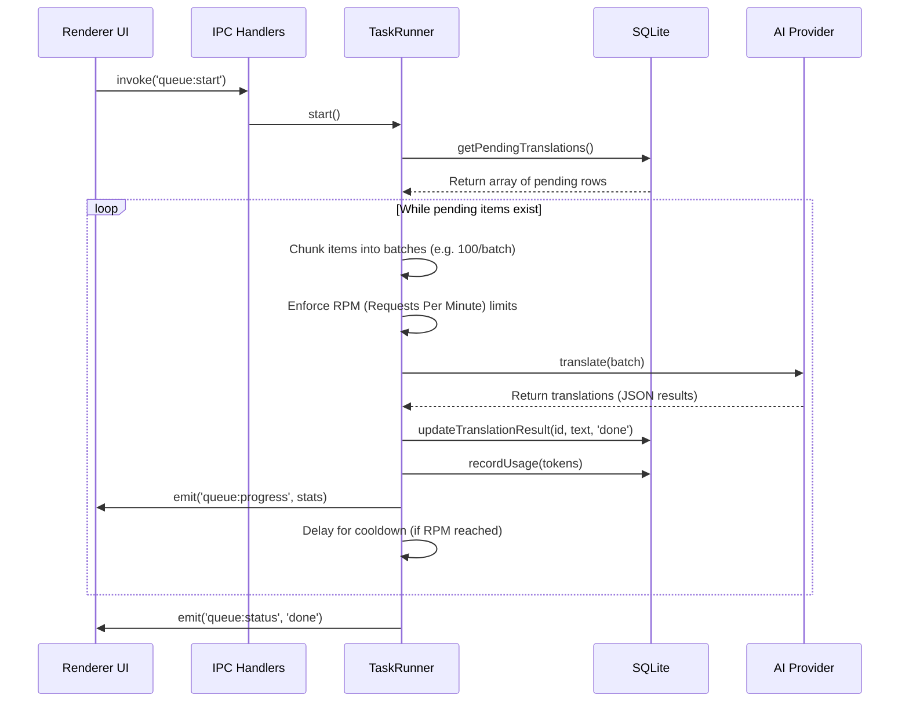
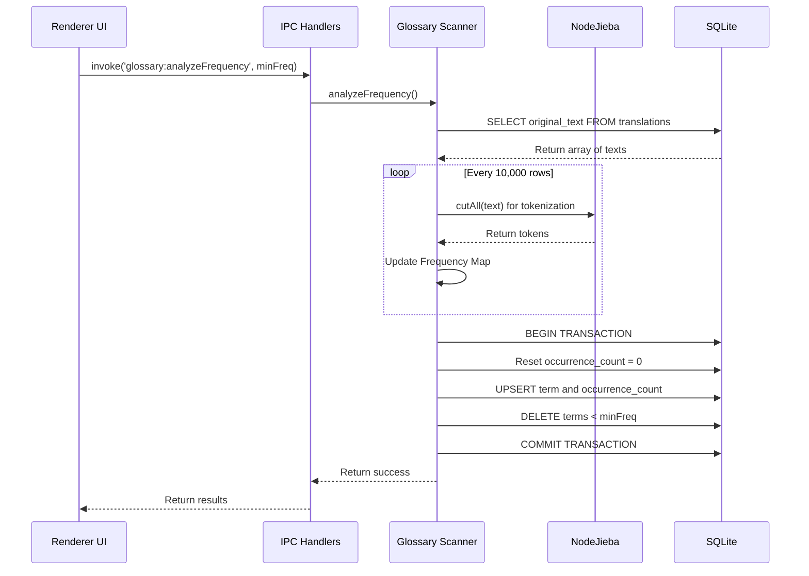
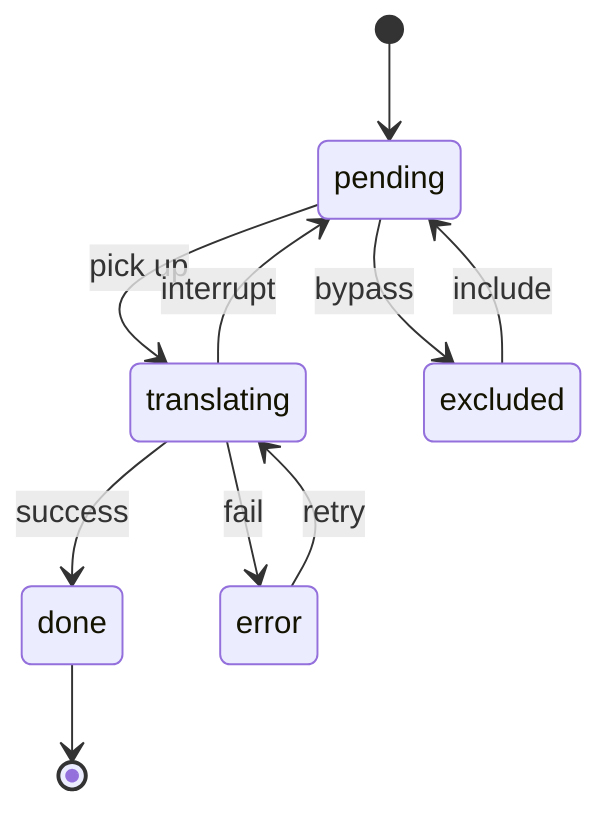

# Sutura - System Architecture

Sutura is an Electron-based desktop application designed for surgical codebase translation. It uses native `tree-sitter` for precise AST parsing, multiple AI providers for translation, and buffer-based byte replacements to inject translated text without breaking source code formatting or logic.

---

## 1. Database Architecture

Sutura utilizes `better-sqlite3` configured with `WAL` (Write-Ahead Logging) for high-performance, synchronous data persistence in the main process. This ensures robust local state management without blocking the UI.

---

## 2. Core Process Flows

### The Parser Extraction Pipeline

This demonstrates the logical pipeline when a file is scanned, parsed, and its text content is extracted to the database.

### The Translation Lifecycle

This outlines the asynchronous dispatch and translation loop, showing how segments move from the user interface through the database and out to the AI providers. This happens _after_ the codebase has been scanned and parsed.

### The Glossary Discovery Scan

This flow dictates how Sutura natively scans the codebase to generate and suggest unified terminology translations.

---

## 3. The Parser Engine (`tree-sitter`)

Unlike regex-based tools, Sutura parses source files into a complete Abstract Syntax Tree (AST) to accurately identify what is code and what is human-readable text.

### Key Parser Features

- **Native Grammar Loading:** Grammars are loaded dynamically (e.g., `tree-sitter-javascript`, `tree-sitter-go`). If a grammar fails to load or isn't supported, Sutura falls back to a custom **regex-based basic text fallback** to ensure no file is left behind.
- **Node Targeting:** The AST is recursively walked. Only nodes mapping to `COMMENT_NODE_TYPES` (e.g., `line_comment`, `block_comment`) or `STRING_NODE_TYPES` (e.g., `string_literal`, `template_string`) are extracted.
- **Nested Parsing (Vue/HTML):** For Single File Components (SFCs), Sutura detects `<script>` or `<style>` blocks, extracts their `raw_text`, and spawns a secondary child parser (e.g., TypeScript or CSS) to walk the embedded code accurately.
- **Unicode Script Filtering:** Sutura applies Unicode regex patterns (e.g., `[\u4e00-\u9fff]` for Chinese) against extracted nodes. This prevents the system from accidentally translating English API keys, URL paths, or purely Latin identifiers.
- **Mixed String Literals Splitting:** If a large string literal (like a massive SQL query) contains embedded quotes holding source-language text, Sutura breaks it down using `extractInnerQuotedSegments`. This prevents the AI from hallucinating or modifying the functional code wrapping the target string.

---

## 4. AI Provider Abstraction & Task Runner

The translation pipeline is heavily optimized to minimize token consumption and prevent API limits.

### AI Provider Architecture (`src/main/ai/`)

- **Unified Interface:** Providers implement a common `AIProvider` interface (e.g., `GeminiProvider`, `OpenAIProvider`, `LlamaCppProvider`). This normalizes inputs and captures `UsageStats` uniformly.
- **Cloud & Local Parity:** Supports cloud models (Gemini, OpenAI, Anthropic, DeepSeek) via standard APIs, and local models (Ollama, llama.cpp) via REST endpoints.
- **Truncated JSON Repair:** AI models sometimes cut off responses mid-JSON due to `max_tokens` limits. `parseTranslationResponse` utilizes a robust regex `repairTruncatedJson` fallback that can rescue and parse partial array segments rather than failing the entire batch.

### The Batching Engine (`TaskRunner`)

- **Token Optimization:** Segments are batched into chunks (e.g., 100 items per request). The payload maps to `{ id, og }` and strictly asks the AI to return `{ id, tr }`. Grouping `COMMENT` nodes separately from `STRING_LITERAL` nodes allows the system prompt to apply different safety constraints (e.g., forbidding internal quotes for string literals).
- **RPM & Cooldown Engine:** The Runner respects a user-defined Requests Per Minute (RPM) limit. It dispatches concurrent batches up to the RPM limit (the "burst"), then yields execution with a cooldown timer to avoid `429 Too Many Requests` responses. If a 429 _is_ hit, an exponential backoff retry mechanism catches it.

---

## 5. The 'Suture' Injection System

The injection process (`src/main/injector.ts`) modifies source files surgically using Buffer mechanics.

- **Buffer-Based Byte Mapping:** Standard string replacement is unreliable and dangerous. Sutura converts the target file into a UTF-8 `Buffer`. It translates `tree-sitter`'s `line_start` and `col_start` identifiers into exact byte-offsets (`byteStart`, `byteEnd`).
- **Multi-Byte Shift Handling:** Since UTF-8 characters can take up to 4 bytes, tree-sitter columns can sometimes misalign with pure JS string lengths. `findTextNearPosition` performs a localized sliding-window search to verify the target bytes exist exactly where expected before splicing.
- **Virtual vs. Physical Commit:**
  - **Virtual Injection:** Replacements are concatenated onto a memory buffer and returned to the UI for live preview. Disk I/O is completely bypassed.
  - **Physical Commit:** Sutura saves the original buffer to the `file_backups` SQLite table. It then overwrites the source file on disk with the translated buffer. If the user detects a regression, clicking "Revert" instantly drops the backup blob directly back to the filesystem.

---

## 6. Glossary & Tokenization Engine

To maintain consistency across large codebases, Sutura implements an automated Glossary scanner.

- **Process Flow:** The UI triggers `analyzeFrequency`. The scanner pulls thousands of untranslated rows from the database.
- **Tokenization:** For Chinese text, it leverages `nodejieba` (a C++ Chinese tokenizer) to split sentences into discrete words. For standard text, it uses regex word boundaries.
- **Frequency Aggregation & Upsert:** The scanner maps word frequencies across the workspace. It runs a single massive SQLite transaction to `UPSERT` terms that meet the minimum occurrence threshold, simultaneously cleaning up terms that no longer exist in the codebase.

---

## 7. Native Module & Production Bridge

Sutura relies on deeply integrated C++ Native modules that require specific structural hand-offs between Vite and Electron.

- **Native Bridge:** Modules like `better-sqlite3`, `tree-sitter`, and `nodejieba` cannot be bundled safely by Rollup. In `electron.vite.config.ts`, these are excluded via `externalizeDepsPlugin()` and explicitly defined under `build.rollupOptions.external`.
- **Critical Technical Note (`submodules/cppjieba/dict`):** When building for production, `nodejieba` requires access to physical dictionary `.utf8` files to instantiate correctly. If these dictionary files are packed within the read-only `app.asar` archive, `nodejieba` will throw fatal initialization exceptions. The build configuration ensures these dictionaries resolve to the unpacked `app.asar.unpacked` folder on disk.

---

## 8. State Machine & Error Resilience

Translations operate via a strict lifecycle to ensure no data is lost during interruptions.

**Resilience:** The persistent `error` state guarantees that if the app is closed or network fails, Sutura will not rescan the file. The `TaskRunner` simply targets `error` and `pending` segments on the next run, allowing progressive forward momentum on massive codebases.
